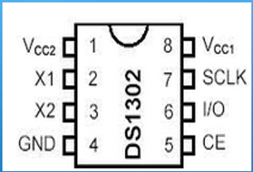
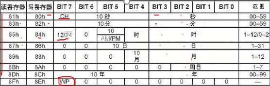
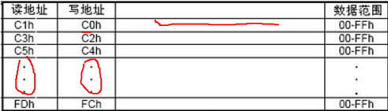
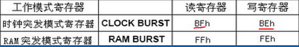
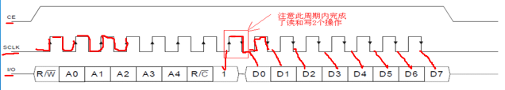
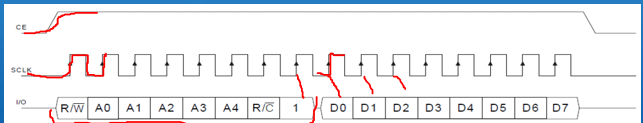

# DS1302实时时钟

----

DS1302是美国DALLAS推出的一款高性能、低功耗的日历时钟芯片。 DS1302是一种串行接口的实时时钟，芯片内部具有可编程的日历时钟和31个字节的静态RAM，日历时钟可以自动进行闰年补偿，计时准确，接口简单，使用方便，工作电压范围宽（2.5~5.5V），芯片自身还具有对备用电池进行涓流充电功能，可有效延长备用电池的使用寿命。DS1302用于数据记录，能实现数据与该数据出现的时间同时记录，因此广泛应用于测量系统中。



### 引脚功能

- VCC1：主电源

- VCC2：备用电源，当VCC2大于VCC1+0.2时由VCC2向DS1302供电，否则由1供电

- SCLK：串行时钟输入端，控制数据输入与输出；

- I/O：双向输入端

- CE：使能端，CE为高时允许读写DS1302数据，为低时禁止读写  

### DS1302寄存器  

时钟日历和控制寄存器：  



时钟日历寄存器包含在7个读/写寄存器内，读/写寄存器中的数据是*BCD码*
**秒寄存器（81h、80h）**的BIT7定义为时钟暂停标志（CH）。当该位置为1时，时钟振荡器停止，DS1302处于低功耗状态；当该位置为0时，时钟开始运行。  
**小时寄存器（85h、84h）**的BIT7用于定义DS1302是运行于12小时模式还是24小时模式，当为1时，选择12小时模式，此时BIT5为AM/PM位，在24小时模式时此位为小时数据位。
**控制寄存器（8Fh、8Eh）**的BIT7是写保护位（WP），其它7位均为0。在任何对时钟或RAM读写操作之前，WP位必须为0。当WP位为1时，不能对任何时钟日历寄存器或RAM进行写操作。

31个字节静态RAM寄存器：



DS1302的工作模式寄存器：


*突发模式：即一次传送多个字节的时钟信号或RAM数据*

### DS1302通信时序

**此中数据的传输是从最低位（bit0）开始**数据是以位（BIT）为单位依次写入或读出，读写数据操作中SCLK上升沿时执行写入数据，下降沿时执行读出数据。
#### 读数据：

CE端从低到高的一个上升沿开始允许开始读数据，拉低CE端则禁止读写数据；开始的8个SCLK周期，写命令字节，数据的后8个SCLK 周期读出数据。

#### 写数据：


CE端从低到高的一个上升沿开始允许开始写数据，拉低CE端则禁止读写数据；开始的8个SCLK周期，写命令字节，数据的后8个SCLK 周期写入数据。

## BCD码

*在DS1302中有关时钟日历的积存器数据储存格式为BCD码*

### BCD码介绍

我们时钟日历寄存器使用的是8421码型的BCD码，BCD码还有5421码、2421码等，其中8421码型的BCD码最最常用；

BCD码是用四位二进制数表示一位十进制数的0-9这十个数简称BCD码；               8421码型BCD码最小值为0000（二进制），最大值为1001（二进制）；一个字节的8421码型BCD码中的低四位用于表示十进制的个位，高四位用于表示十进制的十位，如10（十进制）的8421码型BCD码=0001 0000；

### BCD码用程序转换实例

 ```cpp
//BCD码转换为数据
uchar BCD_Chg_Dat(uchar dat)
{
	uchar dat1, dat2;
	dat1 = dat / 16;
	dat2 = dat % 16;
	dat2 = dat2 + dat1 * 10;
	return dat2;
}
//数据转BCD码
uchar Dat_Chg_BCD(uchar dat)
{
	uchar dat1, dat2;
	dat1 = dat / 10;
	dat2 = dat % 10;
	dat2 = dat2 + dat1 * 16;
	return dat2;
}
 ```

### DS1302读写代码

 ```cpp
/*	TRST为端口CE
	TSCLK为端口SCLK
	TIO为IO口		*/
//写DS1302数据
void Write_DS1302_DAT(uchar cmd, uchar dat)
{
	uchar i;
	TRST = 0; //拉低使能端
	TSCLK = 0;//拉低数据总线
	TRST = 1; //拉高使能端，产生上升沿开始写数据
	for(i = 0; i < 8; i++)//每次写1位，写8次
	{
		TSCLK = 0;		  //拉低时钟总线
		TIO = cmd & 0x01; //写1位数据，从最低位开始写
		TSCLK = 1;		  //拉高时钟总线，产生上升沿数据被DS1302读走
		cmd >>=1;		  //右移一位
	}
	for(i = 0; i < 8; i++)//每次写1位，写8次
	{
		TSCLK = 0;		  //拉低时钟总线
		TIO = dat & 0x01; //写1位数据，从最低位开始写
		TSCLK = 1;		  //拉高时钟总线，产生上升沿数据被DS1302读走
		dat >>= 1;		  //右移一位
	}
}
//读DS1302数据
uchar Read_DS1302_DAT(uchar cmd)
{
	uchar i, dat;
	TRST = 0;  //拉低使能端
	TSCLK = 0; //拉低数据总线
	TRST = 1;  //拉高使能端，产生上升沿开始写数据
	for(i = 0; i < 8; i++)//每次写1位，写8次
	{
		TSCLK = 0;		 //拉低时钟总线
		TIO = cmd & 0x01;//写1位数据，从最低位开始写
		TSCLK = 1;		 //拉高时钟总线，产生上升沿数据被DS1302读走
		cmd >>=1;		 //右移一位
	}
	for(i = 0; i < 8; i++)//每次读1位，读8次
	{
		TSCLK = 0;		  //拉低时钟总线,产生下降沿，DS1302把数据放到TIO上
		dat >>= 1;		  //右移一位
		if(TIO)	dat |= 0x80;//读取数据，从最低位开始
		TSCLK = 1;			//拉高时钟总线，以备下一次产生下降沿
	}
	return dat;	//返回读出数据
}

 ```

