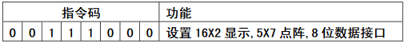

# LCD1602

-----

##  引脚定义


## 操作时序

### 操作指令

1. 读状态 	输入：RS=L，RW=H，E=H										输出：D0~D7=状态字
2. 写指令     输入：RS=L，RW=L，D0~D7=指令码，E=高脉冲     输出：无
3. 读数据     输入：RS=H，RW=H，E=H                                        输出：D0~D7
4. 写数据     输入：RS=H，RW=L，D0~D7=数据，E=高脉冲        输出：无

### 状态字说明


**对控制器每次进行读写操作之前，都必须进行读写检测，确保STA7为0**  

### RAM地址映射图

控制器内部带有80X8位（80字节）的RAM缓冲区，对应关系如图  


### 指令说明

1. 初始化设置
   1. 显示模式设置
      
   2. 显示开/关及光标设置
      
      

2.数据控制

   1. 数据指针设置
      

   2. 读数据
   3. 写数据
   4. 其他设置
      

3. 初始化过程（复位过程）
   1. 延时15ms
   2. 写指令38H（不检测忙信号）
   3. 延时5ms
   4. 写指令38H（不检测忙信号）
   5. 延时5ms
   6. 写指令38H（不检测忙信号）
   7. （以后每次写指令，读/写数据操作之前均需检测忙信号）
   8. 写指令38H：设置显示模式
   9. 写指令08H：显示关闭
   10. 写指令01H：显示清屏
   11. 写指令06H：显示光标移动设置
   12. 写指令0CH：显示开及光标移动设置

## 源代码

```cpp
/*	针脚定义：
	RS：针脚4
	RW：针脚5
	EN：针脚6
*/
//判断液晶忙，如果忙则等待
void Read_Busy()
{
	uchar busy;
	P0 = 0xff;
	RS = 0;
	RW = 1;
	do
	{
		EN = 1;
		busy = P0;
		EN = 0;
	}while(busy & 0x80);
}
//写LCD1602命令一个字节
void Write_Cmd(uchar cmd)
{
	Read_Busy();//判断忙
	RS = 0;
	RW = 0;
	P0 = cmd;
	EN = 1;
	EN = 0;
}
//写一个字节数据
void Write_Dat(uchar dat)
{
	Read_Busy();
	RS = 1;
	RW = 0;
	P0 = dat;
	EN = 1;
	EN = 0;
}
void main()
{
	uint k = 1000;
	uchar i;
	uchar *a[]={"Monday ", "Tuesday ", "Wednesday "};
	uchar *pa;//指针变量pa
	Write_Cmd(0x38);//设置16*2显示
	Write_Cmd(0x0f);//开显示 显示光标，光标闪烁
	Write_Cmd(0x01);//清屏

	Write_Cmd(0x07);//地址指针移位命令
	Write_Cmd(0x80 | 0x10);//显示地址
	for(i = 0; i < 3; i++)
	{
		pa = a[i];
		while(*pa != '\0')
		{
			Write_Dat(*pa++);
			while(k--);
		}
	}
	while(1);
}
```

